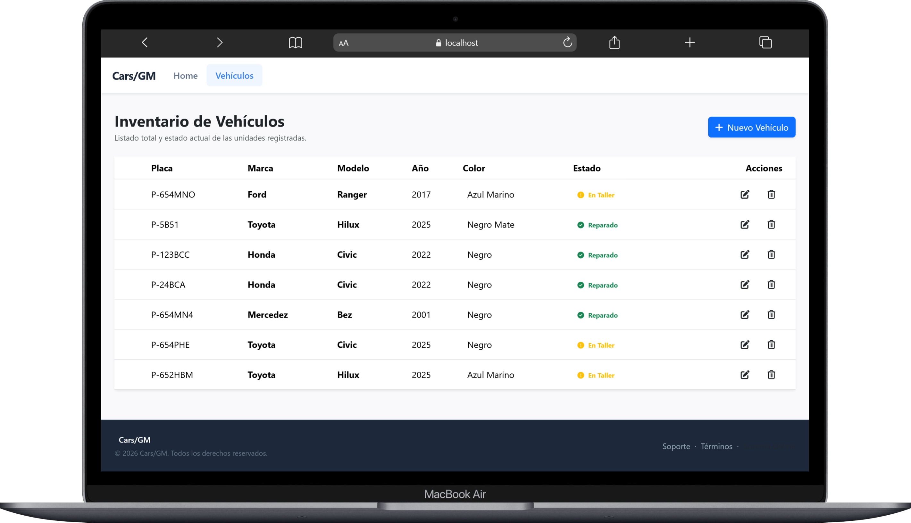

# CRUD Vehículos Fullstack

Aplicación web fullstack para la gestión de vehículos. Permite crear, listar, editar, eliminar y consultar vehículos registrados en una base de datos MySQL.

---

## Tecnologías utilizadas

### Frontend
- Angular
- TypeScript
- Bootstrap
- SweetAlert2

### Backend
- Node.js
- Express
- Sequelize
- MySQL
- dotenv
- CORS

---

## Funcionalidades

- Listado de vehículos
- Registro de nuevos vehículos
- Edición de información
- Eliminación con confirmación
- Validaciones en formulario
- Conexión frontend-backend mediante API REST
- Base de datos MySQL con script incluido

---

## Eliminación lógica

El proyecto utiliza eliminación lógica mediante `paranoid: true` de Sequelize.

Esto significa que cuando se elimina un vehículo, el registro no se borra físicamente de la base de datos. En su lugar, Sequelize llena el campo `deleted_at`.

Los registros eliminados no aparecen en las consultas normales, pero siguen existiendo en la base de datos.

---

## Capturas

### Pantalla principal

<p align="center">
  
</p>

---

### Listado de vehículos

<p align="center">
  
</p>

---

### Registro de vehículos

<p align="center">
  
</p>

---

### Edición de vehículos

<p align="center">
  
</p>

---

## Estructura del proyecto

```bash
backend/
frontend/
database/
```

---

## Instalación

### 1. Clonar repositorio

```bash
git clone https://github.com/rudymoran18-blip/crud-vehiculos-fullstack.git
cd crud-vehiculos-fullstack
```

### 2. Configurar backend

```bash
cd backend
npm install
cp .env.example .env
npm run dev
```

### 3. Configurar frontend

```bash
cd frontend
npm install
ng serve
```

### 4. Configurar base de datos

Ejecutar:

```bash
database/script.sql
```

en:
- MySQL Workbench
- phpMyAdmin
- Consola MySQL

---

## Variables de entorno

Crear archivo `.env` basado en:

```bash
.env.example
```

---

## Autor

Desarrollado por Rudy Isaías Morán Gómez.